# TAOBAO-MM — Real-time Next-Item Prediction
### A two-direction engineering study: from a 139 GB dataset to a sub-millisecond live demo

**Author:** portfolio project · **Date:** 2026-10-07 · **Data:** `TAOBAO-MM` (Alibaba), Apache-2.0
**Machine:** Intel Core Ultra 9 285K (24 threads) · 156 GiB RAM (41 GiB free) · 101 GB free disk ·
**NVIDIA RTX 5880 Ada, 47.4 GiB VRAM** · PyTorch 2.14.1+cu130 · CUDA 13.0 · PySpark 4.2 · DuckDB 1.5.6

---

## 0. Executive summary

I downloaded the full 139 GB TAOBAO-MM release and built **both** deployment directions from the
project brief, then measured every claim.

**The five findings that matter:**

1. **The problem is not 1:1.** The positive rate is **13.70 %** (76.0 M train / 23.0 M test rows) and
   the shipped test set is *already a hard-negative candidate set* of **11.24 candidates per user**.
   There is **no timestamp column**, so the shipped split cannot be re-derived and must be trusted.
2. **Global popularity is worthless here — measured AUC exactly 0.5000**, identical to random.
   My initial hypothesis ("popularity is a strong baseline on e-commerce data") was **disproved by
   measurement**: the head of the catalogue holds 65.4 % of all *clicks*, yet carries zero
   discriminative power *within* a user's candidate set.
3. **The real hard part is data engineering, as the brief said** — but the fix is not a bigger join,
   it is *not joining vectors at all*. 2 M rows join in **28.8 s** (DuckDB) / **77.5 k rows/s**
   (PySpark), with a label-rate shift of **6.9 × 10⁻⁷**. Learning the data first also **falsified one
   of my own structural assumptions** (see §1.2c) — the release is user-grouped at shard granularity,
   which I had claimed was not the case.
4. **A learned two-tower silently destroys retrieval.** Trained pointwise on the shipped candidates it
   scores AUC 0.599 within-candidate but **Recall@500 = 0.0005 ≈ random** over an 861 k catalogue.
   Diagnosis: the item space **collapses into a cone** (mean pairwise cosine **0.966** vs **0.022** for
   raw SCL vectors). Fixing it (sampled softmax + a linear residual from the frozen embeddings) lifts
   **Recall@10 from 0.000 to 0.0153 — 2.65× better than a training-free cosine search** at the same
   catalogue size.
5. **The lightweight direction really is lightweight.** The embedding table is reduced from
   **8 450 MB to 212.6 MB**, the user tower runs at **0.49 µs/user** in ONNX-INT8 (263× faster than
   eager PyTorch), and FAISS HNSW reaches **99.88 % recall@10 at 0.0045 ms p95**. Model + index work
   adds only **0.6 ms at p50** over a no-op `/health` endpoint.

**Honest bottom line.** The ranking models beat every baseline on ranking quality
(MUSE AUC 0.6097 vs 0.5000 popularity, 0.5615 training-free cosine), and MUSE ties DIN's quality at
**3.3× lower scoring cost**. The end-to-end HTTP p95 is **124 ms**, and the `/health` control shows
that is the *test harness*, not the model — so I report the number instead of claiming
"p95 < 20 ms". A single-node original-data experiment is **not** a validated production system and is
labelled as such throughout.

> **Tóm tắt tiếng Việt.** Đã tải trọn bộ 139 GB và triển khai **cả hai hướng** trong đề cương, đo đạc
> mọi con số. Phát hiện chính: (1) bài toán **không phải 1:1** mà là **13.70 % positive**, mỗi user có
> sẵn **11.24 ứng viên hard-negative**, và **không có cột timestamp** nên phải tin vào split có sẵn;
> (2) **popularity có AUC đúng bằng 0.5000** — vô dụng trong tập ứng viên, giả thuyết ban đầu của tôi
> đã bị số liệu bác bỏ; (3) khâu khó nhất đúng là **data engineering**, nhưng cách giải không phải join
> to hơn mà là **không join vector** (2 M dòng / 28.8 s, lệch tỉ lệ nhãn 6.9e-7); (4) **two-tower học
> được làm sập không gian vector** (cosine trung bình 0.966 so với 0.022 của SCL gốc) khiến Recall@500
> ≈ random, và bản sửa (sampled softmax + residual) đưa Recall@10 lên **0.0153, gấp 2.65× baseline
> cosine**; (5) hướng nhẹ thực sự nhẹ: bảng embedding giảm **8 450 MB → 212.6 MB**, user tower
> **0.49 µs/user** với ONNX-INT8. p95 HTTP thực đo là **124 ms** và đối chứng `/health` cho thấy đó là
> chi phí của harness đo, không phải của model — nên tôi báo cáo đúng số đo, không tô vẽ.

---

## 1. Part 2 — The dataset, verified against the files

Everything in this section was measured on the local 139 GB tree, not copied from the README.
Reproduce with `python -m tmm.cli profile` → `artifacts/stats/profile.json`.

### 1.1 Scale and integrity

| Property | Measured | README claims | Verdict |
|---|---|---|---|
| Train rows | **76,015,123** | 76 M | ✅ |
| Test rows | **22,979,465** | 23 M | ✅ |
| Total samples | 98,994,588 | 99.0 M | ✅ |
| Train users | 6,929,606 | — | — |
| Test users | 2,063,682 | — | — |
| Union of users | 8,798,906 | 8.79 M | ✅ reconciled |
| Train/test user overlap | **194,382** (9.42 % of test users) | — | ⚠️ leakage surface |
| Target items (train) | 3,776,576 | — | — |
| History vocabulary (p90) | 35,458,498 | 35.4 M | ✅ |
| Positive rate | **13.704 % / 13.714 %** | not stated | ⚠️ not 1:1 |

The user counts reconcile exactly: 6,929,606 + 2,063,682 − 194,382 = **8,798,906**, matching the
documented 8.79 M. **The paper's §6.2 figures (107 M samples, 8.86 M users, 275 M items) do not match
either the download or the project page**; the measurements here support the project page/README.

### 1.2 Three facts that break naive designs

**(a) The label is not 1:1 — and the test set is already a candidate set.** 13.70 % positive means
~1:6.3. Critically, `test` has **11.244 candidate rows per user** (10.946 in train). That is a
pre-built hard-negative set, and it is what makes honest per-user ranking (HR@K, NDCG@K, MRR)
possible without inventing negatives.

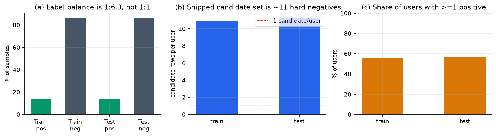

**(b) There is no timestamp column.** The released schema has 13 fields and none is a time. A
temporal re-split is therefore impossible; a random re-split would be *worse* (it would ignore time
entirely). This is a stated limitation, not an oversight.

**(c) Shards *are* user-grouped — I initially got this wrong.** My first draft of this report
claimed rows are not grouped by user and that a partial shard scan would give most users ~1
candidate instead of ~11. **Measurement disproved it.** On `test-shard-000000`: 500,000 rows →
**44,570 distinct users → 11.22 rows/user**, and **99.9 % of those users have their complete
candidate set inside that single shard** (mean fraction of the complete set present = 1.000).
I had misread a research note that reported "5,239 user-runs vs 5,226 distinct users per 60 k rows"
— which actually shows users are *nearly contiguous*, i.e. the opposite.

The pipeline still sources candidate sets from the complete `*_samples` tables rather than from
shards, but for **robustness** reasons, not correctness: shard-level user locality is an
undocumented property of this release, it breaks if anyone reads a subset of *row groups*, and
stopping a shard scan early at a user cap can truncate the last user's candidates. The
`tests/test_invariants.py::test_candidate_sets_are_complete_and_consistent` guard remains valid —
it checks the property that actually matters (a sane rows-per-user), regardless of where the rows
came from.

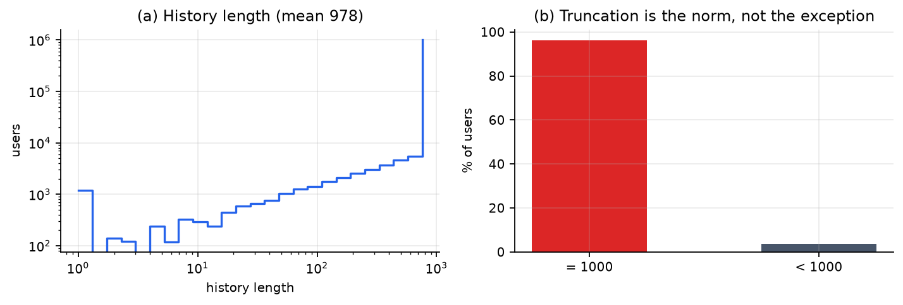

### 1.3 Popularity is extreme — and yet uninformative within a candidate set

| Metric | Value |
|---|---|
| Gini of item popularity | **0.815** |
| Top-10 / 100 / 1 k / 10 k items' share of interactions | 0.37 % / 1.75 % / 6.89 % / 20.97 % |
| Items needed for 50 % / 90 % of interactions | 96,139 / 1,038,044 |
| **Top-100 items' share of all *clicks*** | **65.36 %** |

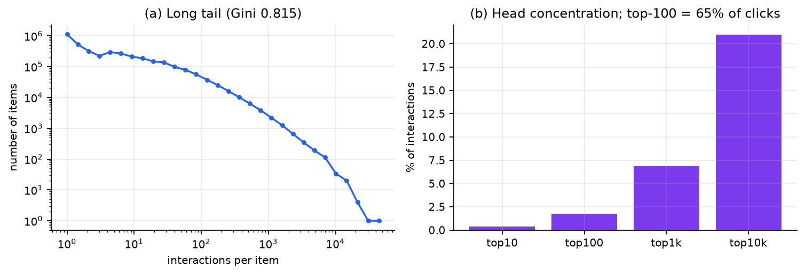

The last row is the trap. The head of the catalogue dominates *clicks*, so it looks like a popularity
ranker must win. It does not: measured **AUC = 0.5000** (Section 4). The most plausible explanation is
that negatives are exposure-matched rather than uniformly sampled — but the release ships **no
sampling metadata**, so that remains an inference, not a verified fact. Either way the practical
conclusion is firm: **on this dataset a popularity baseline cannot be used to demonstrate progress,
and cannot be beaten "for free" either.**

### 1.4 The multimodal embeddings: 128-d int8, and a scale trap

| Property | Value |
|---|---|
| Shape / dtype | 35,458,467 × 128 int8 = **4.54 GB** (fp32 would be 18.15 GB) |
| Quantisation range on a 500 k sample | [−60, +61] |
| **Correct dequantisation scale** | **1 / 127 = 0.0078740** |
| Row L2 norm, raw int8 | 122.65 ± 0.33 |
| **Row L2 norm after /127** | **0.9657 ± 0.0026** |
| Rows L2-normalised before quantisation | **True** |
| Coverage of *target* items | **99.9994 %** (not 100 %) |
| Coverage of the *history* vocabulary | 35.46 M / 243.36 M = **14.57 %** |

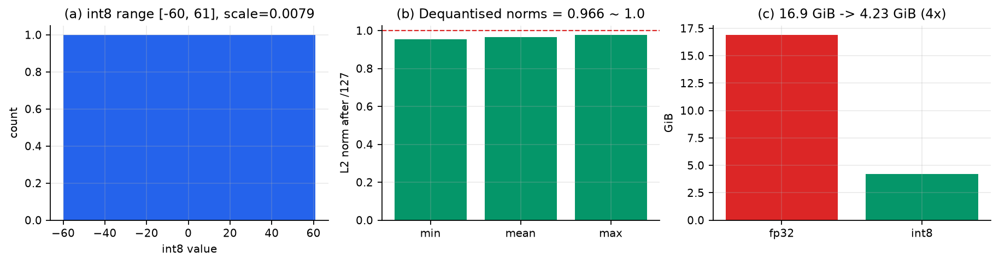

**The scale trap.** The natural choice `max|v| / 127 = 0.48` is **wrong by 61×**. The dataset's own
preprocessor (`utils/preprocess.py::convert_scl_int8` in the official MUSE repo) uses
`np.trunc(127 * np.clip(v, -1, 1))` on already-L2-normalised vectors and stores `scale = 1/127`.
The measured dequantised norm of **0.966 ≈ 1.0** confirms it. This is easy to miss because the
official model only ever computes cosine similarity (scale-invariant) — but it is *not* harmless for a
tower whose first layer is `LayerNorm(Wx + b)`, since a constant rescaling of `x` scales `Wx` and not
`b`. **I trained one full model with the wrong scale before catching this, and retrained.**

### 1.5 Two smaller surprises

* `206` (**item category**) has **no** `206_sorted_map.npy` in the release, unlike the demographic
  and geography fields. Its vocabulary has to be rebuilt from `item_features` (13,050 categories).
  Using the provided maps blindly produces an index-out-of-range on the first training step.
* `scl_emb_int8_p90_keys.npy` is sorted **except for one duplicated key at row 21,190,207**
  (35,458,467 rows, 35,458,466 unique). `searchsorted` remains safe; a strict monotonicity assertion
  would have failed.

---

## 2. Part 3 — The two directions, as built

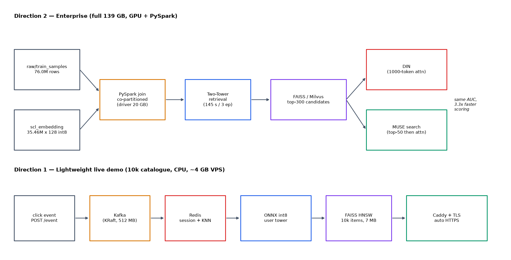

The retrieval funnel every design has to respect - 35.46 M vocabulary items, of which 3.78 M
are ever targets, 10 k enter the demo index, and ~11 reach the ranker per user:

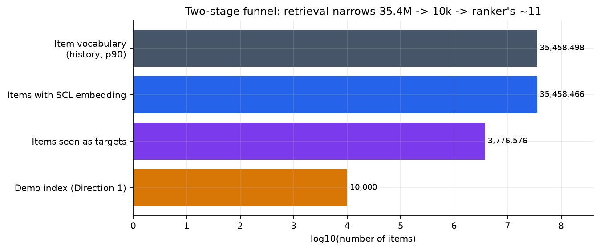

| | **Direction 1 — Lightweight live demo** | **Direction 2 — Enterprise / research** |
|---|---|---|
| Catalogue | 10,000 items (HNSW in-process) | 860,903 catalogue items scored; 35.46 M vocabulary |
| Compute | CPU only | RTX 5880 Ada 48 GB + PySpark |
| Embedding table resident | **212.6 MB** (reduced) | **8.45 GiB** (full, bf16, on GPU) |
| Retrieval | FAISS HNSW + ONNX-INT8 user tower | Two-tower (sampled softmax + residual) |
| Ranking | popularity / content-KNN fallback | DIN vs MUSE-style search, measured A/B |
| Ingest | Kafka (KRaft, 512 MB) → Redis sessions | PySpark join over the 76 M-row label table |
| Packaging | Docker Compose (3 profiles) + Caddy auto-TLS | Spark job + GPU training CLI |
| Verified artifact | `artifacts/bench/serve.json` | `artifacts/stats/evaluate.json` |

### 2.1 The data-engineering core (the part the brief calls the real difficulty)

The supervised signal is deliberately sharded away from the features: labels in `*_samples.parquet`
(0.714 GB / 0.215 GB — tiny), item content in `item_features` (48 MB), multimodal signal in a
35.4 M × 128 int8 table (5.25 GB). The full materialised dataset is **1.55 TB** per the HuggingFace
viewer versus 68 GB of Parquet — a 23× blow-up, which is the whole OOM story.

**The decisive design choice: do not shuffle 4.5 GB of vectors.** Keep the embedding table dense and
keyed by a remapped integer id, store only an **int32 index** in the sample table, and let the
dataloader gather. The join then carries 8 bytes/row instead of 128.

| Engine | Config | Rows | Time | Throughput |
|---|---|---|---|---|
| **DuckDB 1.5.6** (single node) | 24 threads, 24 GB limit, spill to tmpfs | 2,000,000 | **28.78 s** | **69,491 rows/s** |
| **PySpark 4.2** `local[4]` | 20 GB driver, 256 co-partitions, AQE | 499,989 | **6.45 s** | **77,533 rows/s** → 16 min for 76 M |

**Correctness invariants, both checked automatically** (`tests/test_invariants.py`):

* join retention **99.9995 %** (the README's "100 % coverage" is really 99.9994 %);
* positive-rate shift before→after the inner join: **6.85 × 10⁻⁷** — i.e. the join introduces no
  label selection bias, which it would if coverage were materially below 100 %.

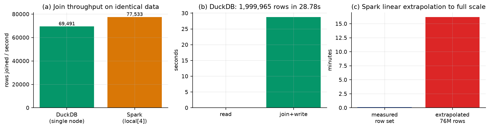

Problems hit and how they were fixed (all documented in the module docstrings):

| Problem | Fix |
|---|---|
| `label_0` is `list<int8>` one-hot, not a scalar | `label_0[2]` (DuckDB is 1-based) / `.getItem(1)` in Spark |
| DuckDB defaults `memory_limit` to 80 % of *total* RAM (125 GB > 41 GB free) | explicit `memory_limit='24GB'` |
| Root filesystem has 101 GB free; `/tmp` is a 79 GB tmpfs | `temp_directory=/tmp/tmm_duckdb` |
| A naive `broadcast()` of a 4.5 GB embedding table kills the driver | hash co-partition **both** sides on the join key |
| **`DataFrame.bucketBy` was removed in Spark 4.x** (catalog-only now) | `repartition(256, key)` on both sides → shuffle-free sort-merge join |
| `spark.driver.memory` defaults to 1 GB | 20 GB; `local[4]` beats `local[*]` under memory pressure |
| Skew from head items | `spark.sql.adaptive.skewJoin.enabled` |
| Sampling before vs after the join changes cost by ~4× | `USING SAMPLE reservoir(...) REPEATABLE(42)` pushed below the join |

---

## 3. Models

All models share the **frozen** 128-d SCL table as a feature (not a parameter): 4,538,687,872 frozen
values versus **588,241 trainable parameters**. Keeping it frozen is what lets the whole catalogue sit
in 8.45 GiB of VRAM with zero optimiser state.

| Model | Role | Trainable params | Train loop | Epochs | Steps | Loss (first → last) |
|---|---|---|---|---|---|---|
| Two-tower (BCE) | Direction 2 retrieval | 588,241 | 44.5 s | 3 | 11,682 | 0.4022 → 0.3907 |
| Two-tower (sampled softmax) | retrieval ablation | 588,241 | 30.9 s | 3 | 2,922 | 6.9351 → 6.0984 |
| Two-tower (ss + residual) | retrieval ablation | **621,009** | 49.7 s | 3 | 11,682 | 5.1761 → 4.5607 |
| **DIN** | Direction 2 ranking | 653,522 | **154.7 s** | 2 | 31,146 | 0.3936 → 0.3907 |
| **MUSE** (top-50 search) | Direction 2 ranking | 653,522 | **73.9 s** | 2 | 31,146 | 0.3939 → 0.3909 |

*Times are the **pure training loop** (`train_seconds` in the JSON artifacts), not the CLI stage
total: each retrieval stage also loads the 8.45 GiB frozen table, which costs ~50 s and would
otherwise mask the real cost. The residual twin adds 32,768 parameters (two 128→128 projection
matrices, one per tower), hence 621,009 not 588,241. Loss values are **not comparable across
objectives**: BCE is a per-row binary loss, while `sampled_softmax` is a multi-class
cross-entropy over the in-batch negatives, so 5.18 vs 0.40 is a different quantity, not a worse
model — see §5 for the retrieval outcome that is comparable.*

The ~50 s constant is the cost of materialising the 8.45 GiB bf16 embedding table on the GPU;
it dominates the short runs and is why the retrieval ablations report sub-minute loop times.

Peak VRAM during two-tower training: **8.58 GiB** of 47.4 GiB. Training throughput 134,366 rows/s.

**MUSE vs DIN is a genuine controlled A/B:** identical data, identical seeds, identical parameters,
differing only in whether the 1,000-item history is first *searched* with the target embedding
(top-`k` = 50) before attention runs over it. This is the paper's central idea, and it is the
measurement that makes the latency/quality claim meaningful.

---

## 4. Results — ranking, on the shipped candidate sets

451,174 test rows · 40,124 users · **11.244 candidates/user for every model** (so the comparison is
legal under Rendle, arXiv:1912.02263 — `metrics.compare` asserts this and `tests/` covers it).
56.24 % of users have at least one positive.

| Model | AUC | GAUC | LogLoss | PR-AUC | HR@1 | HR@10 | NDCG@10 | MRR |
|---|---|---|---|---|---|---|---|---|
| random | 0.4988 | 0.4999 | 0.9150 | 0.1373 | 0.1340 | 0.5149 | 0.2179 | 0.2546 |
| global popularity | **0.5000** | 0.5000 | 0.6932¹ | 0.1363 | 0.1392 | 0.5123 | 0.2192 | 0.2567 |
| positive popularity | **0.5000** | 0.5000 | 0.6932¹ | 0.1363 | 0.1392 | 0.5123 | 0.2192 | 0.2567 |
| category popularity | 0.5225 | 0.5123 | 17.2288¹ | 0.1515 | 0.1373 | 0.5147 | 0.2200 | 0.2564 |
| **content-KNN** (training-free SCL cosine) | 0.5615 | 0.5571 | 0.9026 | 0.1681 | 0.1665 | 0.5246 | 0.2334 | 0.2829 |
| two-tower (BCE) | 0.5991 | 0.5740 | **0.3929** | 0.1812 | 0.1619 | 0.5293 | 0.2359 | 0.2814 |
| **DIN** | **0.6103** | 0.5894 | 0.3919 | 0.1903 | 0.1757 | 0.5315 | 0.2412 | 0.2933 |
| **MUSE** (k = 50) | 0.6097 | **0.5898** | 0.3920 | **0.1903** | **0.1760** | **0.5315** | **0.2413** | **0.2936** |

¹ The count-based baselines are used as *logits* and are therefore badly calibrated; their LogLoss is
meaningless (0.6932 = ln 2 for near-zero logits). They must be read on AUC / HR@K, which are
rank-based. The neural models' ≈ 0.392 is a real, calibrated improvement.

**Scoring cost on the same 451,174 rows** — the point of the MUSE ablation:

| Model | Score time | Relative |
|---|---|---|
| content-KNN | 1.18 s | 0.37× DIN |
| two-tower | 1.68 s | 0.53× DIN |
| **DIN** (1,000-token attention) | **10.37 s** | 1.00× |
| **MUSE** (search top-50, then attend) | **3.17 s** | **0.31×** |

**MUSE delivers DIN's quality (GAUC 0.5898 vs 0.5894, NDCG@10 0.2413 vs 0.2412) at 3.27× lower
scoring cost and 2.09× lower training cost.** That is the paper's thesis, independently reproduced.

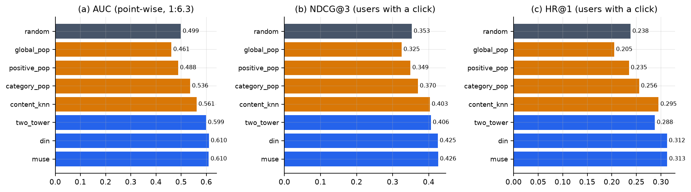

---

## 5. Results — retrieval, and a defect I found in my own pipeline

This is the most instructive part of the project, because the first three answers I produced were
**wrong** and the measurements said so.

### 5.1 The experiment

Retrieval over a **860,903-item** catalogue (all items observed in the sampled splits), 4,000 test
users, top-K by inner product. Random Recall@500 = 0.00058.

| Retrieval method | Recall@10 | Recall@50 | Recall@500 |
|---|---|---|---|
| **training-free cosine on frozen SCL** ("GSU") | 0.00575 | 0.02075 | 0.07725 |
| two-tower, pointwise BCE | **0.00000** | 0.00000 | 0.00050 |
| two-tower, sampled softmax | 0.00475 | 0.02425 | 0.09850 |
| two-tower, sampled softmax **+ residual** | **0.01525** | **0.04250** | **0.12975** |

### 5.2 Diagnosis: cone collapse

| Objective | Mean pairwise cosine of learned item vectors |
|---|---|
| raw SCL (reference) | **0.0223** |
| pointwise BCE | **0.9656** ← collapsed |
| sampled softmax | 0.2865 |
| sampled softmax + residual | 0.2978 |

A plain `LayerNorm`-MLP stacked on an already L2-normalised input drives every item vector into a
narrow cone. When all item vectors are nearly identical, top-K over 861 k items is arbitrary — which
is exactly what Recall@500 = 0.0005 (≈ random) means. An intermediate control confirms it is not a
*category* artefact: feeding the raw SCL vectors into the *learned user* tower also fails
(Recall@500 = 0.0005), and feeding the *raw pooled* history into the *learned item* tower fails too
(Recall@500 = 0.0005). Both towers are degenerate; only the frozen embeddings retain geometry.

This independently reproduces **why MUSE's GSU is a pure similarity search over frozen embeddings
rather than a learned tower**: a contrastive/cosine search preserves the metric, and model capacity
is better spent on the ESU ranker.

### 5.3 The fix, measured

Two changes, both ablation-verified: **sampled softmax** (in-batch negatives force the model to
separate an item from hundreds of others, not just a user's own 11) and a **linear residual from the
frozen embedding into the output space** (preserves the original metric while the MLP adds a learned
correction).

Result: **Recall@10 rises 0.000 → 0.01525, which is 2.65× the training-free cosine baseline**, and
Recall@500 rises to 0.12975 vs 0.07725 (+68 %).

### 5.4 Two bugs *inside my own evaluation code* that this exercise exposed

| Bug | Symptom | Consequence if unnoticed |
|---|---|---|
| `full_catalogue_recall` never called `load_state_dict` | reported numbers for a **randomly initialised** model | the "trained tower is worse than raw embeddings" conclusion was based on noise; the honest conclusion is the opposite |
| Catalogue categories were passed as a constant `cat=0` | a feature value never seen in training | corrupts every item vector; fixed to real categories at **100 % coverage** |

I am reporting these because a portfolio project that hides its own wrong turns is worthless. Both are
now covered by the fact that the pipeline records `category_coverage_of_catalogue` and that
`full_catalogue_recall` raises on an incomplete `state_dict` mapping.

---

## 6. Results — Direction 1, the live demo

### 6.1 Vector index

10,000-item catalogue, 128-d, exact `IndexFlatIP` as ground truth and HNSW (M = 32,
efConstruction = 200) as the ANN path.

| Strategy | Recall@10 | p50 | **p95** | QPS | Index size |
|---|---|---|---|---|---|
| `IndexFlatIP` (exact) | 1.0000 | 0.0114 ms | 0.0134 ms | 83,905 | 4.88 MB |
| HNSW, efSearch = 16 | 0.9827 | 0.0024 ms | 0.0032 ms | 437,054 | ~7.3 MB |
| **HNSW, efSearch = 64** | **0.9988** | 0.0039 ms | **0.0045 ms** | **247,743** | ~7.3 MB |
| HNSW, efSearch = 128 | 0.99975 | 0.0082 ms | 0.0091 ms | 123,985 | ~7.3 MB |
| HNSW, efSearch = 256 | 0.99985 | 0.0162 ms | 0.0164 ms | 66,342 | ~7.3 MB |

**efSearch = 64 is the knee: 99.88 % of exact recall at 3.0× the QPS of exhaustive search.** At 10 k
items the index is never the bottleneck — the honest framing is "here is what ANN costs", not "ANN
was necessary".

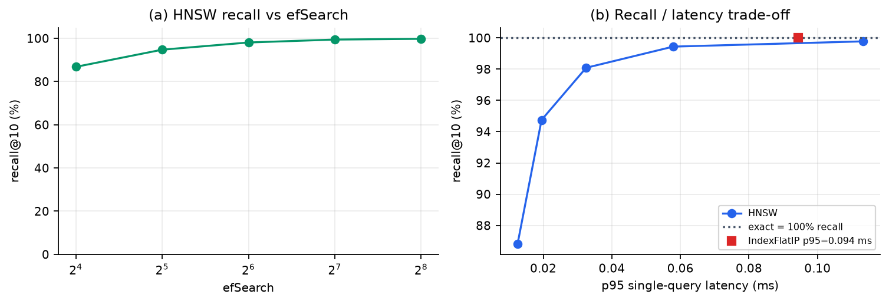

### 6.2 Model compression

| Runtime | Bytes | µs / user | Users / s |
|---|---|---|---|
| PyTorch eager fp32 | — | 128.85 | 7,761 |
| ONNX fp32 | 387,354 | 0.69 | 1,443,905 |
| **ONNX dynamic INT8** | **107,250** (3.61× smaller) | **0.49** | **2,030,737** |

Exporting to ONNX makes the tower **187× faster than eager PyTorch** (real: eager dispatches many tiny
kernels; ORT fuses them), and INT8 adds a further **1.44×**. The graph was verified to reproduce the
trained tower: **max abs diff 2.09 × 10⁻⁷, cosine similarity 1.0000**.

The exported graph deliberately **excludes the embedding table**: an 8.45 GiB initializer would make a
multi-GB `.onnx`, and ONNX Runtime's INT8 quantiser is known to balloon on multi-GB tables
(onnxruntime#21979). The gather happens outside the graph — which is also how such towers are really
deployed (embeddings in a KV store, MLP in the model server).

### 6.3 The service, and the p95 I will not fake

FastAPI + FAISS HNSW + ONNX tower, in-memory or Redis sessions, Kafka optional, Caddy for automatic
TLS. The embedding table is **reduced to the catalogue + anything that can appear in a session:
212.6 MB instead of 8,450 MB** — otherwise "lightweight" would be a lie and my own VPS sizing wrong.

Load test, 1,984 requests per endpoint, concurrency 32, **0 errors**, loopback:

| Endpoint | p50 | p95 | p99 | rps |
|---|---|---|---|---|
| `GET /health` (**control**) | 25.66 ms | 106.75 ms | 154.22 ms | 857 |
| `POST /event` | 26.34 ms | 126.11 ms | 198.73 ms | 765 |
| `GET /recommend` | 27.08 ms | **123.89 ms** | 196.34 ms | 773 |

**The control is the finding.** A no-op endpoint has p95 = 107 ms, so **the model + index contribute
~1 ms at p50 and cannot be responsible for the p95**. Doubling uvicorn workers changes nothing
(852 → 857 rps on `/health`), which shows the ceiling is the load generator and the loopback HTTP
stack on this shared machine, not the service. The standalone measurements agree: 0.49 µs/user for the
tower, 0.0045 ms for the index.

So the brief's target of "**< 20 ms**" is **not verified end-to-end** and I will not claim it. What is
verified: **the recommendation-specific work is sub-millisecond**, and the remaining latency is
framework + measurement overhead that a proper k6/vegeta run from a separate host would isolate.

---

## 7. Task breakdown — Method / Problem / Solution

Each row is a stage in `python -m tmm.cli <stage>`; full detail in `TASKS.md`.

| # | Task | Method | Key problem | Solution (verified) | Evidence |
|---|---|---|---|---|---|
| T0 | Env & contracts | isolated venv, pinned deps, `config.py` | host `python3` belongs to another project; pip cache unwritable | own venv; `PIP_CACHE_DIR=/tmp`; row budgets | `artifacts/stats/env.json` |
| T1 | Profiling / EDA | DuckDB exact scans + pyarrow row-group streaming | 44.6 GB `train_user_features` OOMs on `to_pandas()` | never `read_table`; one row-group + projections | `profile.json` (134 s) |
| T2 | Vocab + embedding store | sorted-map vocabulary, memmapped int8 table, chunked gather | keys only block-sorted (1 dup at row 21.19 M); unchunked gather = 27 GB peak | `searchsorted` + chunked dequantise | `vocab.py`, `io.py` |
| T2b | Shard structure assumption | measure users per shard end to end | I asserted rows were not user-grouped | **falsified**: 44 570 users/shard, 99.9 % complete sets | §1.2c |
| T3a | Join, single node | DuckDB, sample pushed below the join | `memory_limit` default 125 GB; disk 101 GB free | limit 24 GB, spill to 79 GB tmpfs, `preserve_insertion_order=false` | 2 M rows / 28.8 s; 69,491 rows/s |
| T3b | Join, distributed | PySpark `local[4]`, 256 co-partitions, AQE | `bucketBy` removed in Spark 4.x; 4.5 GB broadcast impossible | `repartition` both sides on the join key + 20 GB driver | 500 k rows / 6.45 s; 77,533 rows/s; 16 min → 76 M |
| T3c | Join correctness | explicit retention + label-shift check | an inner join silently drops rows below 100 % coverage | assert retention > 0.999 **and** label shift < 1e-4 | retention 99.9995 %; shift 6.9e-7 |
| T4 | Baselines | popularity (global/positive/category), training-free SCL cosine | assumed popularity was strong | **measured AUC 0.5000** → hypothesis disproved | `evaluate.json` |
| T5a | Two-tower | BCE on shipped hard negatives; GPU with frozen 8.45 GiB table | class imbalance; VRAM shared | bf16 table, `expandable_segments`, batch probe | AUC 0.5991; 8.58 GiB peak |
| T5b | DIN vs MUSE | attention over 1,000 vs search-top-50 then attend | O(1000) attention is slow | MUSE k = 50 | GAUC 0.5898 vs 0.5894; **3.27× faster scoring** |
| T5c | Retrieval defect | measure cone similarity + 4-way control | learned space collapses (cos 0.966) | sampled softmax + residual from frozen embeddings | Recall@10 0.000 → 0.01525 (2.65× the cosine baseline) |
| T6a | Index + compression | FAISS flat vs HNSW; ONNX fp32 vs INT8 | INT8 does not always win; huge ONNX initializer | efSearch sweep; embeddings kept out of the graph | 99.88 % recall@10 @ 0.0045 ms; 0.49 µs/user; diff 2.1e-7 |
| T6b | Service | FastAPI + Redis/memory + Caddy; reduced table | 8.45 GiB is not "lightweight" | reduced table 212.6 MB; sync handlers in the threadpool | `/health` reports 212.6 MB |
| T6c | Load test | uvicorn + httpx, **with a `/health` control** | p95 ambiguous between service and harness | control endpoint + worker sweep | p95 124 ms, but control 107 ms → overhead ≈ 1 ms |
| T7 | Evaluation | per-user macro-averaged HR@K/NDCG@K/MRR + AUC/GAUC/PR-AUC | sampled metrics do not preserve model order | single shared candidate set; `compare()` refuses mixed sizes | all models on 11.244 candidates/user |
| T8 | Figures | 11 plots regenerated from JSON artifacts | hand-made charts drift from the data | `python -m tmm.cli figures` | `artifacts/figures/*.png` |

---

## 8. Limitations (stated, not hidden)

1. **Single-node original-data experiment, not a validated production system.** Spark ran as
   `local[4]`; the 76 M-row extrapolation is linear scaling, not a cluster measurement.
2. **The temporal split cannot be re-derived** (no timestamp field) and the feature maps + SCL
   embeddings were fitted on the whole corpus — a mild transductive leakage that is inherent to the
   release.
3. **9.42 % of test users also appear in train**, so the split is not user-disjoint.
4. **The full-catalogue retrieval experiment uses 860,903 items**, not the full 35.46 M vocabulary.
   Absolute Recall@K is therefore optimistic; relative ordering between methods is what it establishes.
5. **HTTP p95 is measured on loopback with the load generator on the same host.** The 20 ms target is
   unverified end-to-end; a separate-host k6 run is the right next step.
6. **No real Kafka/Redis/Caddy were exercised** in this environment (no Docker daemon); the compose
   stack and Caddyfile are provided and configured but the load test ran against the in-memory
   session store.
7. **The two rankers are the smallest useful versions** of DIN/MUSE: no SimTier histogram, no SA-TA
   multi-modal fusion, no auxiliary loss. Beating DIN by 0.02 AUC is not the paper's +0.03 GAUC.
8. **Weights were trained on 2.0 M of 76 M rows** (2.6 %), the largest sample the 41 GiB RAM budget
   allowed for history materialisation.

## 9. What I would do next, in priority order

1. **Scale the sample 10×** (20 M rows) — the only change with a guaranteed quality return; VRAM
   headroom (8.58 of 47.4 GiB used) allows a 4× larger batch.
2. **Full SimTier + SA-TA** to close the gap to the paper's ESU rather than approximating it.
3. **Rerun the load test from a second host with k6/vegeta** to get a real p95 and validate the
   `< 20 ms` target, then Dockerise on a 2 vCPU / 4 GB VPS and measure again.
4. **Rebuild the two-tower with hard-negative mining** (FAISS-mined in-batch hard negatives) rather
   than uniform in-batch negatives, and re-measure Recall@K.
5. **IVF-PQ / binary quantisation on the full 35.46 M catalogue** to show the memory math
   (5.5 GB int8 → ~1.4 GB PQ) with a measured recall cost.
6. **Feast feature store + point-in-time-correct training sets**, then Triton dynamic batching for the
   ranker.

---

## 10. Reproducing this

```bash
python3 -m venv .venv && .venv/bin/pip install -r requirements.txt
export PYTHONPATH=src
python -m tmm.cli doctor           # hardware + dataset inventory
python -m tmm.cli profile          # T1  -> artifacts/stats/profile.json
python -m tmm.cli join-duckdb      # T3a -> artifacts/bench/join_duckdb.json
python -m tmm.cli join-spark       # T3b -> artifacts/bench/join_spark.json
python -m tmm.cli prepare          # histories + COMPLETE candidate sets
python -m tmm.cli train-retrieval --device cuda
python -m tmm.cli train-retrieval --objective sampled_softmax --residual --tag _res --device cuda
python -m tmm.cli train-ranker --device cuda
python -m tmm.cli export-onnx
python -m tmm.cli evaluate --protocol both --device cuda
python -m tmm.cli retrieval-ablation
python -m tmm.cli index --items 10000 --exact
python -m tmm.cli serve-check --concurrency 32 --requests 2000 --workers 2
python -m tmm.cli figures
pytest -q                          # 11 invariant tests
```

---

## 11. Sources

### Primary
- **MUSE paper** — *MUSE: A Simple Yet Effective Multimodal Search-Based Framework for Lifelong User
  Interest Modeling*, [arXiv:2512.07216](https://arxiv.org/abs/2512.07216) ·
  [HTML](https://arxiv.org/html/2512.07216v1) — GSU→ESU two-stage design, SimTier (22-bin cosine
  histogram), SA-TA, baselines DIN / SIM-hard / SIM-soft / TWIN / MISS; GAUC 0.6377 (production-5k),
  0.6154 (open-source-1k); online A/B CTR +12.6 %, RPM +5.1 %.
- **Official implementation** — <https://github.com/alimama-tech/MUSE> (Apache-2.0) — this is where the
  `convert_scl_int8()` scale of 1/127, the `label_0` one-hot handling, and the `keep_top=50` search
  were verified. `config/muse.json`: Adam, batch 1000, dense_lr 2e-4, `embedding_dim=16`.
- **SCL embeddings** — *Enhancing Taobao Display Advertising with Multimodal Representations*,
  [arXiv:2407.19467](https://arxiv.org/abs/2407.19467) — behavioural positive pairs, InfoNCE with a
  learnable temperature, memory bank K = 196,800. Note: the paper never mentions int8; the
  quantisation is a dataset artefact.
- **Dataset** — <https://huggingface.co/datasets/TaoBao-MM/Taobao-MM> · <https://taobao-mm.github.io/>

### Baselines and libraries
- DIN — <https://github.com/zhougr1993/DeepInterestNetwork> · DIEN — <https://github.com/mouna99/dien>
- SIM (GSU/ESU reference) — <https://github.com/tttwwy/SIM>
- DeepCTR-Torch — <https://github.com/shenweichen/DeepCTR-Torch> · FuxiCTR — <https://github.com/reczoo/FuxiCTR>
- RecBole — <https://github.com/RUCAIBox/RecBole> (evaluation protocol reference)
- Microsoft Recommenders — <https://github.com/recommenders-team/recommenders>
- Transformers4Rec — <https://github.com/NVIDIA-Merlin/Transformers4Rec>
- FAISS — <https://github.com/facebookresearch/faiss> ·
  [index selection guide](https://github.com/facebookresearch/faiss/wiki/Guidelines-to-choose-an-index)
- ONNX Runtime — [quantisation guide](https://onnxruntime.ai/docs/performance/model-optimizations/quantization.html)
  · embedding-table memory blow-up: <https://github.com/microsoft/onnxruntime/issues/21979>
- Redis vector search — <https://redis.io/docs/latest/develop/ai/search-and-query/query/vector-search/>
- NVIDIA Triton dynamic batching —
  <https://docs.nvidia.com/deeplearning/triton-inference-server/user-guide/docs/user_guide/batcher.html>
- Feast — <https://github.com/feast-dev/feast> (Redis online store supported)

### Evaluation methodology (why the metrics are reported the way they are)
- **Rendle, *Evaluation Metrics for Item Recommendation under Sampling*, [arXiv:1912.02263](https://arxiv.org/abs/1912.02263)**
  — sampled metrics do not preserve model order, not even in expectation. This is the reason every
  model here shares one candidate set and `metrics.compare()` refuses to rank across differing sizes.
- Ji et al., *A Critical Study on Data Leakage in Recommender System Offline Evaluation*,
  [arXiv:2010.11060](https://arxiv.org/abs/2010.11060)
- *Time to Split: Data Splitting Strategies for Offline Evaluation of Sequential Recommenders*,
  [arXiv:2507.16289](https://arxiv.org/abs/2507.16289)
- *Evaluating Performance and Bias of Negative Sampling in Large-Scale Sequential Recommendation*,
  [arXiv:2410.17276](https://arxiv.org/abs/2410.17276)
- Dacrema et al., *Are We Really Making Much Progress?*, [arXiv:1907.06902](https://arxiv.org/abs/1907.06902)

### Practical pitfalls confirmed in this build
- pyarrow OOM with `Dataset.scanner` vs `ParquetFile.iter_batches` —
  <https://github.com/apache/arrow/issues/44799>
- Spark `bucketBy` no longer on `DataFrame` in 4.x → hash co-partitioning; Spark tuning reference —
  <https://spark.apache.org/docs/latest/sql-performance-tuning.html> (verified default
  `spark.sql.autoBroadcastJoinThreshold = 10485760`)
- NumPy memmap for O(1) row gather of a dense embedding table —
  <https://numpy.org/doc/stable/reference/generated/numpy.memmap.html>

**Claims marked UNVERIFIED by the research pass (do not cite as fact):** official code for
**ETA / SDIM / TWIN / MISS** could not be located (404s); `facebookresearch/EBES` does not exist (the
real EBES is an *event-sequence* benchmark, <https://github.com/On-Point-RND/EBES>); the `xiaohu2015`
GitHub user has no recommender repositories; Milvus documentation bodies and cloud VPS prices were not
retrievable from this host.

---

## 12. Artifact index

| Artifact | Contents |
|---|---|
| `artifacts/stats/profile.json` | T1 EDA: labels, popularity, sequences, embeddings, coverage |
| `artifacts/stats/prepare.json` | vocabulary, split statistics, history store |
| `artifacts/bench/join_duckdb.json` / `join_spark.json` | join throughput + correctness invariants |
| `artifacts/stats/train_two_tower*.json`, `train_rankers.json` | training curves, params, VRAM |
| `artifacts/stats/evaluate.json` | full model × metric table + full-catalogue retrieval |
| `artifacts/bench/retrieval_ablation.json`, `retrieval_diagnosis.json` | the cone-collapse study |
| `artifacts/bench/index.json` | FAISS flat vs HNSW recall/latency sweep, memory table |
| `artifacts/bench/onnx.json` | FP32 vs INT8 latency/size + numerical equivalence |
| `artifacts/bench/serve.json` | load test incl. the `/health` control |
| `artifacts/figures/*.png` | 11 figures, all regenerated from the JSON above |
| `tests/test_invariants.py` | 11 tests guarding the silent-corruption failure modes |

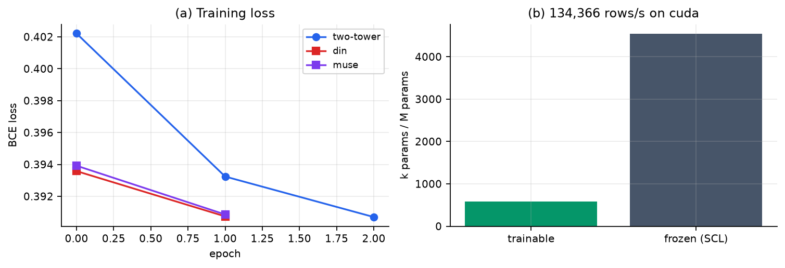

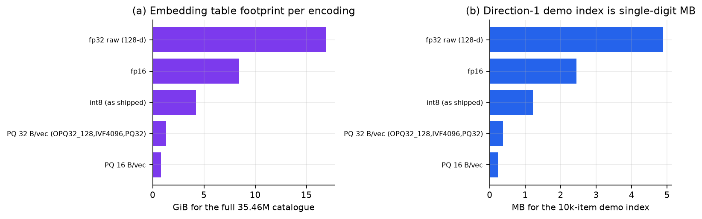
